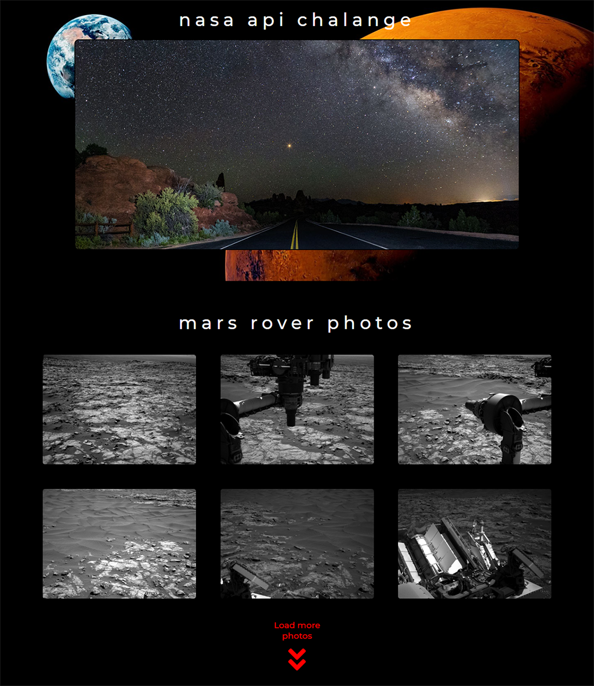

# NASA API Challenge

## Link:
[https://szymtur.github.io/nasa-api-challenge](https://szymtur.github.io/nasa-api-challenge)

## Zadanie polega na wykorzystaniu API udostępnionego przez NASA.

- Zapoznaj się się z [API wystawionym przez NASA](https://api.nasa.gov/index.html). Zobacz jak wyglada dokumentacja, jakie dane możesz otrzymać oraz jak budować zapytania.

- Przed przystąpieniem do pisania kodu, upewnij się, że masz własny API Key (wypełnij formularz na stronie).

- Zadanie polega na stworzeniu strony, która składa się z dwóch sekcji.

- Każda z sekcji powinna mieć 100% szerokości i wysokości okna przeglądarki.

- Pierwsza sekcja to sekcja powitalna. Na samym środku sekcji powinien znajdować się napis __NASA API Challenge__. Tłem całej sekcji powinien być jakikolwiek obrazek (na przykład zdjęcie Ziemi bądź też innej planety) pobrany poprzez API.

- Druga sekcja posiada galerię, który wyświetla zdjęcia Marsa.
Wykorzystaj [API do tego potrzebne](https://api.nasa.gov/api.html#MarsPhotos). Galeria na starcie powinna pokazywać 6 zdjęć. Pod galerią umieść przycisk __Load more__. Po naciśnięciu powinno się pojawić 6 zdjęć więcej.

## Zadania dodatkowe

- Zmodyfikuj zapytanie o obrazek do pierwszej sekcji tak, aby za każdym razem był pobierany inny obrazek.

- Wykorzystaj technikę __preloadingu__ przy wyświetlaniu nowych elementów w galerii.

